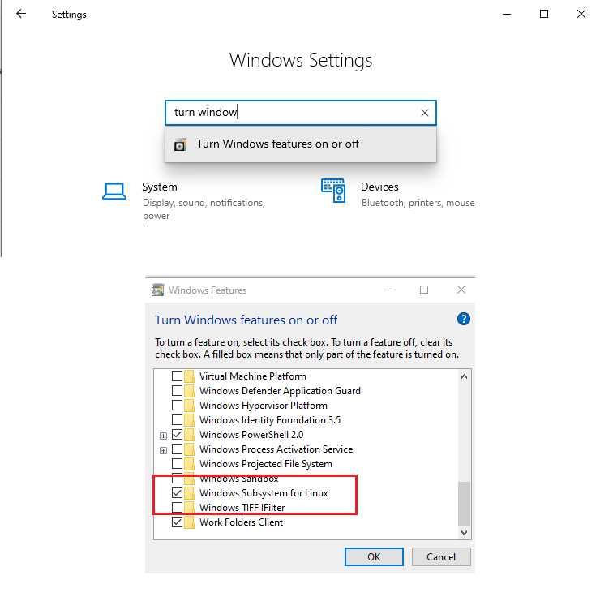

# Crestron OpenSSL Utility (cosu)

Runs on Linux or Windows Subsystem for Linux

Instructions for installing on Windows 10 https://docs.microsoft.com/en-us/windows/wsl/install-win10 
or simply run the following command in an elevated powershell terminal  
```
Enable-WindowsOptionalFeature -Online -FeatureName Microsoft-Windows-Subsystem-Linux
```
or install using Windows features applet



Visual Studio Code can be used as an Editor

MIT License Open Source at https://gihub.com/Crestron/cosu

The intent of this project is to be both a tutorial on the use of OpenSSL and Certificates in general.

It also may provide some basic needs for developers.

The model is intentionally limited to create a single Root Certificate, a single Intermediate Certificate,
and a number of device certificates. It is not meant to be full CA management platform.

#To Use:

1. Copy template_for_settings.cnf as settings.cnf
    a. Edit the fields accordingly - you must set the output folder root.
2. Optionally create the bulklist.csv with the list of devices for a bulk create.
3. Run ./cosu.sh (if you see any errors, you probably didn't set the output folder)
4. You must create the Root and Intermediate Certificates before doing anything else.


When you are done using it you will see the following output structure:

Final tree looks like

/

   root

   signer

   dev1

   dev2

   deploy

      dev1

      dev2

where the output folder has all the files in the right formats

#File Directory:

cosh.sh - startup bash that reads in all others

cosu_menu.sh - contains the main loop and menu applications

cosu_root.sh - contains functions related to generating the root cert

cosu_signer.sh - contains functions related to generating the intermediate cert - root must already exist!

cosu_device_csr.sh - contains functions related to generating a device CSR

cosu_device_cert.sh - contains functions related to generating a device certificate - intermediate must already exist!

cosu_device_setup.sh - some common setup for generating CSRs and certificates

cosu_bulk.sh - creates multiple certificates in one shot - root and intermediate must already exist!

cosu_utils.sh - some functions to help validate IP addresses and to turn debug (trace) on and off.


